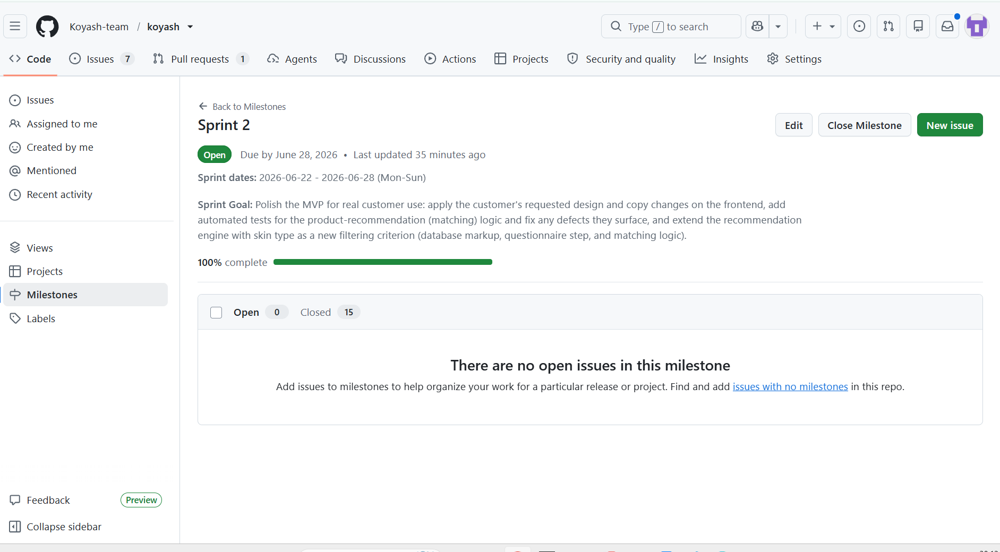
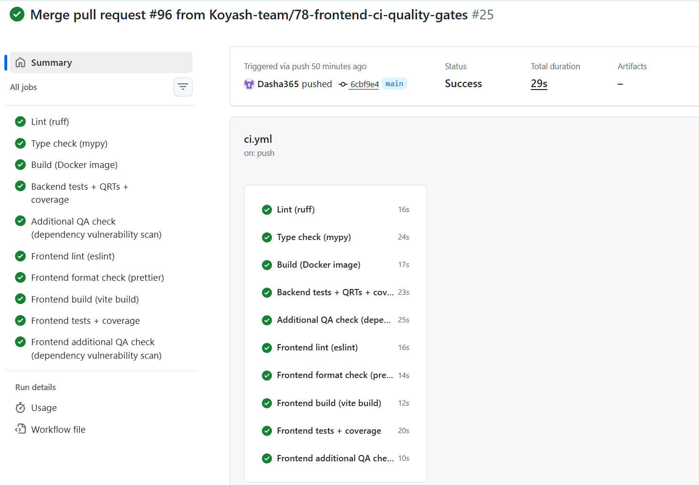
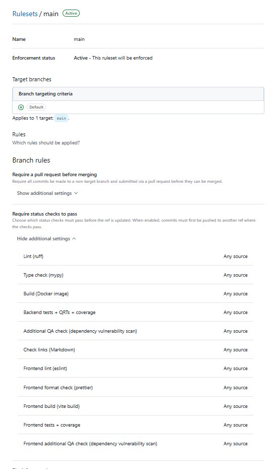
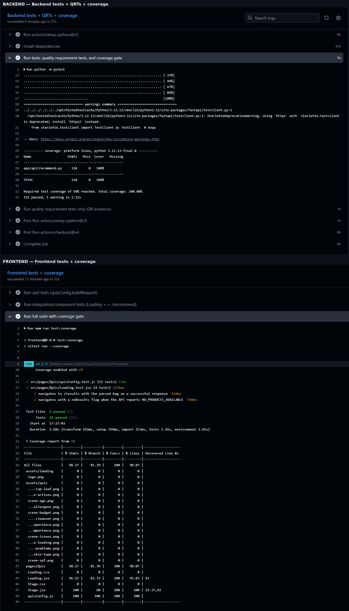
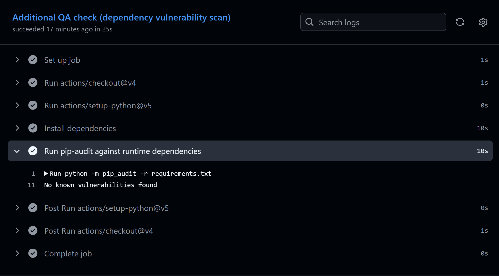
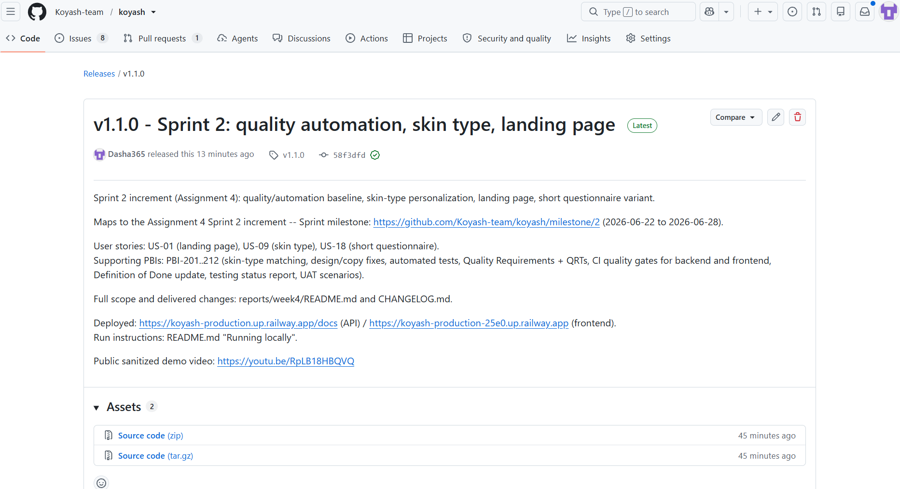
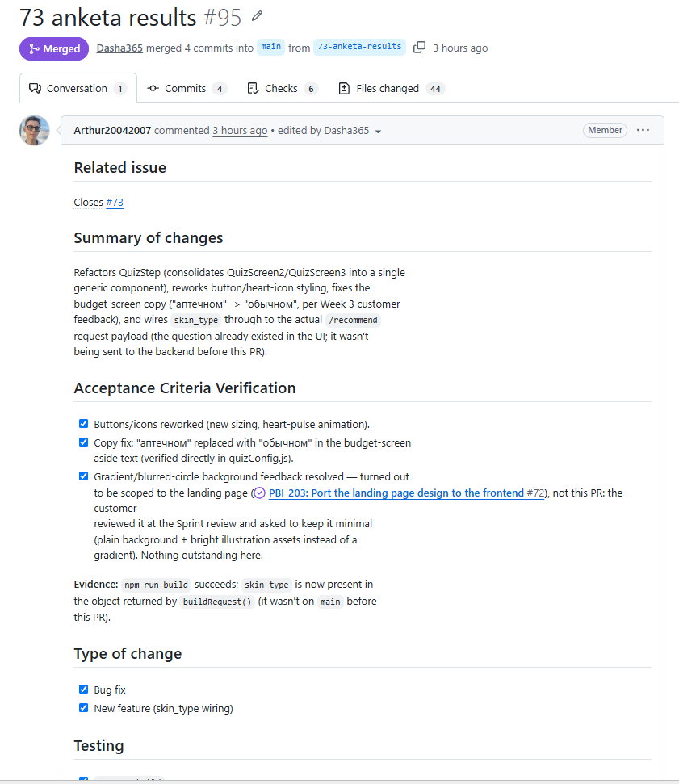
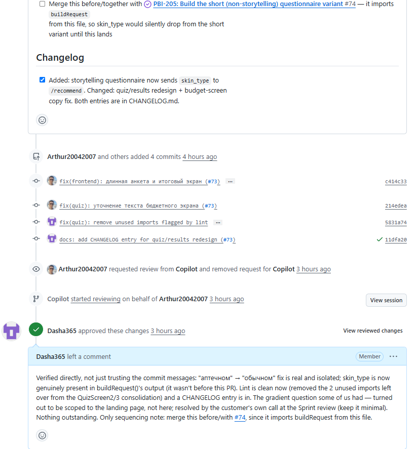

# Week 4 Report — KOYASH (Team 11)

Canonical Week 4 public report and submission index for Assignment 4.

## 1. Project

**KOYASH** is a skincare-product recommendation service: a user answers a guided
questionnaire (budget, allergens, ethical preferences, skin concerns, skin type) and
receives a personalized, ordered cosmetic-bag routine with per-product justification,
drawn from a real product catalog. License: [MIT](../../LICENSE).

## 2–6. Sprint planning

- **Product Backlog board:** <https://github.com/orgs/Koyash-team/projects/1/views/1>
- **Sprint Backlog board:** <https://github.com/orgs/Koyash-team/projects/1/views/2>
- **Sprint milestone:** [Sprint 2](https://github.com/Koyash-team/koyash/milestone/2) — 2026-06-22 to 2026-06-28 (Mon–Sun), 15/15 issues closed.
- **Sprint Goal:** Polish the MVP for real customer use: apply the customer's requested
  design and copy changes on the frontend, add automated tests for the
  product-recommendation (matching) logic and fix any defects they surface, and extend
  the recommendation engine with skin type as a new filtering criterion (database markup,
  questionnaire step, and matching logic). Per [docs/roadmap.md](../../docs/roadmap.md#sprint-2--polish-the-mvp-personalize-by-skin-type-raise-quality-and-automation),
  the focus was customer-feedback-driven design/copy fixes, skin-type personalization, a
  short non-storytelling questionnaire variant, automated testing of the recommendation
  engine, and the Assignment 4 quality/automation baseline.
- **Total Sprint size:** 84 Story Points across 15 PBIs (Modified Fibonacci scale, tracked
  in the Sprint Backlog board's `Story Points` field).
- **Scope:** [US-01](https://github.com/Koyash-team/koyash/issues/5) (landing page),
  [US-09](https://github.com/Koyash-team/koyash/issues/13) (skin type),
  [US-18](https://github.com/Koyash-team/koyash/issues/69) (short questionnaire) ·
  [PBI-201](https://github.com/Koyash-team/koyash/issues/70)–[PBI-205](https://github.com/Koyash-team/koyash/issues/74)
  (skin type + design/frontend) ·
  [PBI-206](https://github.com/Koyash-team/koyash/issues/75)–[PBI-212](https://github.com/Koyash-team/koyash/issues/81)
  (testing and quality automation).

## 7. Delivered product changes

From [CHANGELOG.md `[Unreleased]`](../../CHANGELOG.md):

- **Skin-type personalization:** `POST /recommend` now prefers products matching the
  user's declared skin type within their budget segment, falling back to `any`-type
  products, then to leaving the step empty rather than substituting a mismatched product.
- **Skin-type wired end-to-end:** the storytelling questionnaire now actually sends the
  user's skin-type answer to the backend (the question existed on screen before but the
  request payload silently dropped it).
- **Short, non-storytelling questionnaire variant** (`/quick`): same questions as the
  storytelling flow, no narrative framing, sharing the same request-building and results
  screen.
- **Landing page** (`/`): full build per the Figma design — hero, problem/solution,
  "smart selection", "why trust Koyash", how-it-works, and entry points into both
  questionnaire variants.
- **Storytelling questionnaire/results redesign:** consolidated quiz-screen components,
  reworked button/heart-icon styling, fixed budget-screen copy per customer feedback.
- **Quality and automation baseline:** 3 Quality Requirements + automated Quality
  Requirement Tests, 322 backend + 15 frontend automated tests, 100%/96%/100% line
  coverage on the critical modules, a full CI pipeline (backend + frontend: lint,
  format/type-check, build, unit, integration, QRTs, coverage, dependency-vulnerability
  scan), and hardened branch protection (11 required status checks, required review,
  required review-thread resolution).

## 8–9. Deployment and access

- **Frontend:** <https://koyash-production-25e0.up.railway.app>
- **API + Swagger docs:** <https://koyash-production.up.railway.app/docs>
- **Run instructions:** [README.md "Running locally"](../../README.md#running-locally)

## 10–11. Customer feedback response

Source: [customer-review-summary.md](customer-review-summary.md) (in-person session, 2026-06-26).

| Feedback point | Resulting PBI or issue | Status | Response |
|---|---|---|---|
| Storytelling questionnaire intermittently showed a blank screen after the budget/price step. | Action point A1 | Done | Fixed the same day as the review. |
| Landing-page trust copy repeats the same point twice ("Koyash doesn't create cosmetics" stated in two sections). | Action point A3 — feeds [PBI-204](https://github.com/Koyash-team/koyash/issues/73) | Sprint 2 (this week) | Customer to send a reference formulation; rework scheduled this Sprint. |
| Gradient/background felt too strong/sharp with a visible border; customer prefers a softer, borderless treatment. | Action point A4 | Resolved as a design decision | The team tried restoring a stronger gradient, showed the customer, and she confirmed the page reads better without it — kept as a plain background with the existing bright illustration elements. |
| Brushstroke graphic style doesn't feel cohesive with the "Enter History" element. | Action point A5 | Sprint 3 (next week) | Not addressed this Sprint; scheduled next. |
| Story slides feel text-dense; open question on logo placement and banner sizing. | Action point A6 | Sprint 3 (next week) | Not addressed this Sprint; scheduled next. |
| Short questionnaire still has extra text/solid block that should be trimmed. | Action point A7 | Sprint 3 (next week) | Not addressed this Sprint; scheduled next. |
| Results section top area should shrink; consider an account-login button there. | Action point A8 | Sprint 3 (next week) | Not addressed this Sprint; scheduled next. |
| Open question on formal/informal tone of voice and a gender-assumption in copy. | Action point A9 | Sprint 3 (next week) | Customer researching; not the team's decision alone. |
| No low-budget product for the "toning" step (correctly left empty, not a defect). | Action point A2 | Not planned for this Sprint | Needs a product decision (catalog scope vs. matching-boundary policy) before it becomes a tracked PBI. |
| How precisely the assembled bag should match the selected budget (fill to ceiling vs. full category coverage). | Action point A2 | Not planned for this Sprint | Same product decision as above is needed first. |
| Possible future account system (data stored in a database, not via Outlook auth). | Not yet a PBI | Not planned for this Sprint | Mentioned only; needs backlog refinement before scheduling. |

## 12–17. Maintained documentation

- [docs/roadmap.md](../../docs/roadmap.md)
- [docs/definition-of-done.md](../../docs/definition-of-done.md)
- [docs/quality-requirements.md](../../docs/quality-requirements.md)
- [docs/quality-requirement-tests.md](../../docs/quality-requirement-tests.md)
- [docs/testing.md](../../docs/testing.md)
- [docs/user-acceptance-tests.md](../../docs/user-acceptance-tests.md)

## 18. Quality model and sub-characteristics

Quality requirements follow ISO/IEC 25010, each on a different sub-characteristic, scoped
to the critical module `backend/app/api/recommend.py`:

| QR | Title | Sub-characteristic |
|---|---|---|
| [QR-001](../../docs/quality-requirements.md#qr-001-allergen-safe-recommendations) | Allergen-safe recommendations | Functional correctness |
| [QR-002](../../docs/quality-requirements.md#qr-002-robust-recommendation-across-the-valid-input-space) | Robust recommendation across the valid input space | Fault tolerance |
| [QR-003](../../docs/quality-requirements.md#qr-003-recommendation-response-time) | Recommendation response time | Time behaviour |

## 19. Testing status summary

Full detail: [docs/testing.md](../../docs/testing.md). Critical modules and current line
coverage (required ≥30% per module):

| Critical module | Coverage |
|---|---:|
| `backend/app/api/recommend.py` | 100% |
| `frontend/src/pages/Quiz/quizConfig.js` (`buildRequest`) | 100% |
| `frontend/src/pages/Quiz/Loading.jsx` | 96% |

322 backend tests + 15 frontend tests, all passing.

## 20–22. Test links

- **Unit tests:** [backend/tests/test_recommend_unit.py](../../backend/tests/test_recommend_unit.py) ·
  [frontend/src/pages/Quiz/quizConfig.test.js](../../frontend/src/pages/Quiz/quizConfig.test.js)
- **Integration tests:** [backend/tests/test_recommend_unit.py](../../backend/tests/test_recommend_unit.py)
  (`test_endpoint_happy_path_schema_and_order`, full FastAPI `TestClient` round trip) ·
  [frontend/src/pages/Quiz/Loading.test.jsx](../../frontend/src/pages/Quiz/Loading.test.jsx)
- **Automated Quality Requirement Tests:** [backend/tests/quality/](../../backend/tests/quality/)
  — [QRT-001](../../backend/tests/quality/test_qrt_001_allergen_exclusion.py),
  [QRT-002](../../backend/tests/quality/test_qrt_002_fault_tolerance.py),
  [QRT-003](../../backend/tests/quality/test_qrt_003_recommend_latency.py)

## 23–27. CI and branch protection

- **CI pipeline:** [.github/workflows/ci.yml](../../.github/workflows/ci.yml) (10 jobs) +
  [.github/workflows/lychee.yml](../../.github/workflows/lychee.yml) (link checking) — 11
  required checks in total.
- **Latest protected-default-branch CI run:**
  [CI run](https://github.com/Koyash-team/koyash/actions/runs/28328682771) ·
  [Lychee run](https://github.com/Koyash-team/koyash/actions/runs/28328682766) — both
  passing.
- **Branch protection evidence:** [`main` ruleset](https://github.com/Koyash-team/koyash/rules/17644441)
  — non-fast-forward, 1 required approving review (not the author), required
  review-thread resolution, merge-commit-only, all 11 status checks required.
- **Linting:** [backend (ruff)](https://github.com/Koyash-team/koyash/actions/runs/28328682771/job/83922978400) ·
  [frontend (eslint)](https://github.com/Koyash-team/koyash/actions/runs/28328682771/job/83922978383)
- **Coverage:** [backend tests + coverage](https://github.com/Koyash-team/koyash/actions/runs/28328682771/job/83922978389) ·
  [frontend tests + coverage](https://github.com/Koyash-team/koyash/actions/runs/28328682771/job/83922978392)
- **Additional QA check (dependency vulnerability scanning):**
  [backend `pip-audit`](https://github.com/Koyash-team/koyash/actions/runs/28328682771/job/83922978449) ·
  [frontend `npm audit`](https://github.com/Koyash-team/koyash/actions/runs/28328682771/job/83922978406)
  — both passing, 0 known vulnerabilities. The backend scan found and fixed 9 real CVEs
  on its first run (PR #87); see [docs/testing.md](../../docs/testing.md#additional-qa-check-rationale)
  for full rationale, scope, and limitations.

### Additional QA check: options considered

Per [Repository_Requirements](../../docs/Repository_Requirements.md#quality-automation-and-ci),
options considered against the project's actual stack and current gaps:

- **Static analysis beyond the compiler/type-checker** (e.g. `bandit` for the backend) —
  considered, but `ruff` (lint) and `mypy` (type-check) already cover most of this
  category for the backend; a dependency scan addresses a materially different risk
  (known CVEs in third-party code) that static analysis of the team's own code cannot
  catch.
- **Accessibility checking** (e.g. `axe-core` for the frontend) — genuinely relevant; a
  real accessibility defect (non-focusable nav ``s) was in fact found and fixed
  during manual PR review this Sprint ([PR #94](https://github.com/Koyash-team/koyash/pull/94)).
  Not yet automated in CI — a good candidate for Sprint 3, but not selected now because it
  isn't wired into the pipeline yet.
- **API contract checking** — considered, but the FastAPI/Pydantic models already act as
  an enforced contract, and the existing integration tests validate response schemas
  end-to-end; a dedicated contract-checking tool would largely duplicate that coverage at
  this stage.
- **Performance testing** — already covered by QR-003/QRT-003 (`/recommend` p95 latency).
  Per Repository_Requirements, a single CI check cannot count as both an automated QRT and
  the Assignment 4 additional QA check, so this option was ruled out specifically because
  it already serves the QRT role.
- **Dependency vulnerability scanning (selected)** — addresses a concrete, currently-real
  risk for a customer-facing deployed product with a non-trivial dependency tree on both
  stacks (FastAPI/motor/starlette backend, npm frontend ecosystem); directly actionable
  (version bump); runs in CI as `dependency-audit` (backend, `pip-audit`) and
  `frontend-dependency-audit` (frontend, `npm audit`); proved its value immediately by
  finding 9 real CVEs on its first run.

These gates continue into later project work per
[docs/definition-of-done.md](../../docs/definition-of-done.md#maintained-since-assignment-4)
and [docs/testing.md](../../docs/testing.md#gates-that-continue-into-later-project-work) —
they are maintained project assets, not one-time Assignment 4 submission evidence.

## 28–29. Release and changelog

- **SemVer release for the Sprint 2 increment:** [v1.1.0](https://github.com/Koyash-team/koyash/releases/tag/v1.1.0)
  — points to the `main` commit current at release time, identifies the Assignment 4
  Sprint 2 mapping, and links the Sprint 2 milestone, the deployment, and the demo video.
- **Changelog:** [CHANGELOG.md](../../CHANGELOG.md) — Sprint 2 entries are dated under
  `## [1.1.0] - 2026-06-28` via [PR #97](https://github.com/Koyash-team/koyash/pull/97)
  (pending merge at the time of writing); `[Unreleased]` is empty again above it.

## 30–31. Demo video and presentation

- **Public sanitized demo video (<2 min):** <https://youtu.be/RpLB18HBQVQ> — shows the
  Sprint 2 increment (landing page, skin type, short questionnaire). Linked from the root
  [README.md](../../README.md#deployment) and from the
  [v1.1.0 release](https://github.com/Koyash-team/koyash/releases/tag/v1.1.0).
  **Needs a manual browser playback check before submission** — YouTube blocks automated
  link checkers (lychee and this assistant alike), so this could not be verified
  automatically.
- **Presentation slides:** not committed as a public copy in this repository; submitted
  through the dedicated Moodle slide submission per assignment instructions.

## 32. UAT results summary

Full scenarios: [docs/user-acceptance-tests.md](../../docs/user-acceptance-tests.md).
Executed in person with the customer on 2026-06-26, via the short (non-storytelling)
questionnaire variant (see note below).

| UAT | Result |
|---|---|
| UAT-001: questionnaire → personalized cosmetic bag | Passed |
| UAT-002: declared allergens are never recommended | Passed |
| UAT-003: recommendations reflect declared skin concerns | Passed |

**Most important feedback:** an isolated frontend defect in the storytelling
questionnaire (intermittent blank screen after the budget/price step) was found live and
fixed the same day — see Action point A1 above. A product-catalog gap (no low-budget
"toning" product) and an open question on budget-matching precision were also raised;
both are tracked as Action point A2, pending a product decision.

## 33–34. Customer review evidence

- **Transcript:** [reports/week4/customer-review-transcript.md](customer-review-transcript.md)
  — published publicly; the customer permitted publication of a sanitized transcript.
- **Summary:** [reports/week4/customer-review-summary.md](customer-review-summary.md)

## 35–37. Reflection, retrospective, LLM report

- [reports/week4/reflection.md](reflection.md)
- [reports/week4/retrospective.md](retrospective.md)
- [reports/week4/llm-report.md](llm-report.md)

## 38. Current product status

A live, deployed, end-to-end product (questionnaire → personalized, justified cosmetic
bag), now also covering a landing page, skin-type personalization, and a short
non-storytelling questionnaire variant. The customer has reviewed and approved the
Sprint 2 increment. The recommendation engine is guarded by 3 automated Quality
Requirement Tests, 322 backend + 15 frontend automated tests, and a full CI pipeline
(backend and frontend) enforced via branch protection.

## 39. Next steps

- Manually verify the demo video plays correctly before submission (see §30–31 — could
  not be checked automatically).
- Sprint 3 direction (per [docs/roadmap.md](../../docs/roadmap.md#sprint-3--llm-based-reasoning-direction)):
  introduce LLM-based reasoning and ingredient analysis over the existing rule-based
  candidate selection, pending a committed date from the customer for the LLM API key and
  base prompt (see [reflection.md](reflection.md#friction-and-gaps)).
- Carry forward the design/copy follow-ups not addressed this Sprint (Action points
  A4–A9) and the pending budget-matching/catalog-gap product decision (A2).
- Extend automated frontend test coverage to the remaining UI flow variants, per
  [retrospective.md](retrospective.md#action-points).

## 40. Contribution traceability

GitHub usernames are used in place of names per the repository's sanitization rules.

| Contributor | Issues / PBIs | PRs authored | Review activity |
|---|---|---|---|
| `Dasha365` (Team Lead) | All Sprint 2 PBIs refined/created; [#5](https://github.com/Koyash-team/koyash/issues/5), [#13](https://github.com/Koyash-team/koyash/issues/13), [#69](https://github.com/Koyash-team/koyash/issues/69)–[#81](https://github.com/Koyash-team/koyash/issues/81) | [#82](https://github.com/Koyash-team/koyash/pull/82), [#83](https://github.com/Koyash-team/koyash/pull/83), [#84](https://github.com/Koyash-team/koyash/pull/84), [#87](https://github.com/Koyash-team/koyash/pull/87), [#88](https://github.com/Koyash-team/koyash/pull/88), [#89](https://github.com/Koyash-team/koyash/pull/89), [#90](https://github.com/Koyash-team/koyash/pull/90), [#91](https://github.com/Koyash-team/koyash/pull/91), [#92](https://github.com/Koyash-team/koyash/pull/92), [#96](https://github.com/Koyash-team/koyash/pull/96) | Approved [#93](https://github.com/Koyash-team/koyash/pull/93), [#94](https://github.com/Koyash-team/koyash/pull/94), [#95](https://github.com/Koyash-team/koyash/pull/95) |
| `Arthur20042007` (Backend) | [PBI-202](https://github.com/Koyash-team/koyash/issues/71), [PBI-203](https://github.com/Koyash-team/koyash/issues/72), [PBI-204](https://github.com/Koyash-team/koyash/issues/73), [PBI-205](https://github.com/Koyash-team/koyash/issues/74) | [#86](https://github.com/Koyash-team/koyash/pull/86), [#93](https://github.com/Koyash-team/koyash/pull/93), [#94](https://github.com/Koyash-team/koyash/pull/94), [#95](https://github.com/Koyash-team/koyash/pull/95) | Approved [#87](https://github.com/Koyash-team/koyash/pull/87) |
| `millfsw` | — | — | Approved [#82](https://github.com/Koyash-team/koyash/pull/82), [#83](https://github.com/Koyash-team/koyash/pull/83), [#84](https://github.com/Koyash-team/koyash/pull/84), [#86](https://github.com/Koyash-team/koyash/pull/86), [#89](https://github.com/Koyash-team/koyash/pull/89), [#91](https://github.com/Koyash-team/koyash/pull/91), [#96](https://github.com/Koyash-team/koyash/pull/96) |
| `fedyann` | — | — | Approved [#88](https://github.com/Koyash-team/koyash/pull/88), [#90](https://github.com/Koyash-team/koyash/pull/90), [#92](https://github.com/Koyash-team/koyash/pull/92) |

Customer-facing UAT execution and the Sprint Review were conducted with the full team
present (see [customer-review-summary.md](customer-review-summary.md) participants).

## 41–42. Screenshots

**Sprint 2 milestone** — 100% complete, 15/15 issues closed:

**Latest protected-default-branch CI run** — all 10 `ci.yml` jobs passing:

**Branch protection / rules evidence** — all 11 required status checks on the `main` ruleset:

**Coverage report** — backend (`recommend.py`, 100%) and frontend (`quizConfig.js` 100%,
`Loading.jsx` 96%) coverage output from the same CI run:

**Additional QA check result** — backend `pip-audit`, 0 known vulnerabilities:

**SemVer release** — [v1.1.0](https://github.com/Koyash-team/koyash/releases/tag/v1.1.0):

**Example reviewed, issue-linked PR** — [#95](https://github.com/Koyash-team/koyash/pull/95),
merged, with CI passing and an approval (with review comment) from a team member other
than the author:

